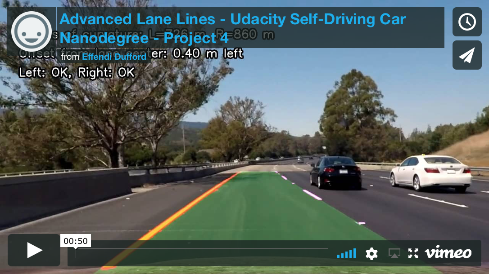
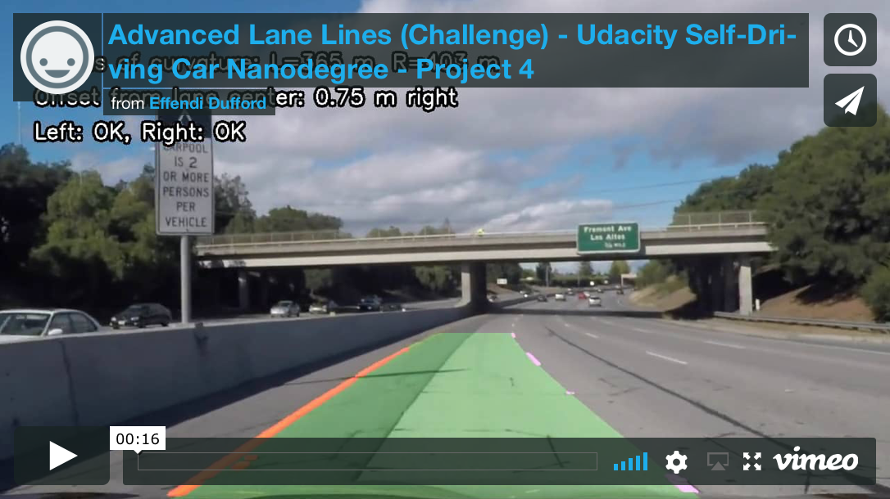
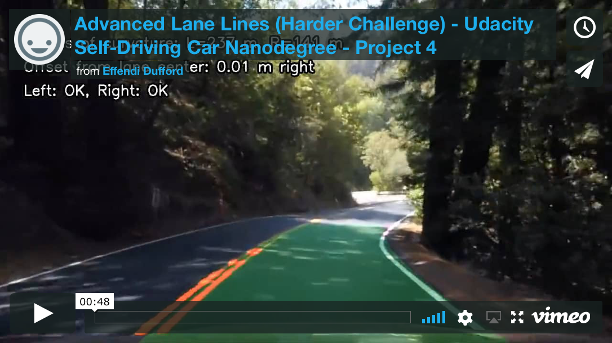

# **Advanced Lane Finding**

**Udacity Self Driving Car Nanodegree - Project #4**

2017/8/20

## Overview

This project makes a **lane detection pipeline using some advanced computer vision techniques** that include camera calibration with chessboard images, distortion correction, perspective transformation to a bird's-eye view of the road surface, color transforms with LAB color space and directional gradient thresholds to mask lane pixels in a binary image, lane line detection and polyfit with sliding window search and lane validity judgement, calculation of radius of curvature and lane center offset, and overlaying the detected lane area back onto the original road image.

Project video result:

Optional challenge video result:

Optional harder challenge video result:

For more details about the results of this activity, see the [project writeup document](writeup_P4.md).

## Key Files

| File 									|     Description	        								|
|:-------------------------------------:|:---------------------------------------------------------:|
| P4_AdvancedLaneLines.ipynb			| IPython notebook with all project code				 	|
| [writeup_P4.md](writeup_P4.md)							| The project writeup explaining the results				|
| /output_images/project_video.mp4		| Output video of lane detection result						|
| /camera_cal/camera_mtx_dist_pickle.p	| Saved pickle file of camera calibration parameters	 	|

The original Udacity project repository is [here](https://github.com/udacity/CarND-Advanced-Lane-Lines).

## How to Run Code

1. Set up [Udacity Self-Driving Car Term 1 Starter Kit](https://github.com/udacity/CarND-Term1-Starter-Kit) environment (Python 3, NumPy, Matplotlib, OpenCV)

2. Open the IPython notebook "P4_AdvancedLaneLines.ipynb" using Jupyter, and execute all cells.
