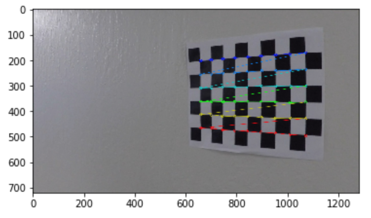
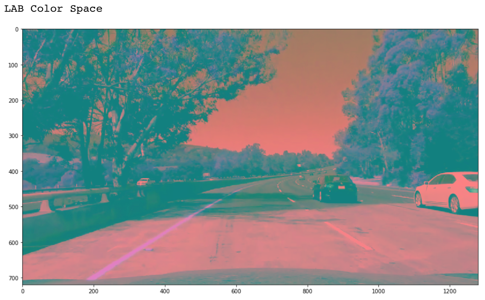

# **Advanced Lane Finding**

**Udacity Self Driving Car Nanodegree - Project #4**

Effendi Dufford
2017/8/20

## Project Goal

The goals / steps of this project are the following:

* Compute the camera calibration matrix and distortion coefficients given a set of chessboard images.
* Apply a distortion correction to raw images.
* Use color transforms, gradients, etc., to create a thresholded binary image.
* Apply a perspective transform to rectify binary image ("birds-eye view").
* Detect lane pixels and fit to find the lane boundary.
* Determine the curvature of the lane and vehicle position with respect to center.
* Warp the detected lane boundaries back onto the original image.
* Output visual display of the lane boundaries and numerical estimation of lane curvature and vehicle position.

## Results by Rubric Criteria

### Writeup / README

#### 1. Provide a Writeup / README that includes all the rubric points and how you addressed each one.

My project files are located in this [github repository](https://github.com/edufford/CarND-Advanced-Lane-Lines-P4).
The key contents are:

| File 									|     Description	        								| 
|:-------------------------------------:|:---------------------------------------------------------:| 
| P4_AdvancedLaneLines.ipynb			| IPython notebook with all project code				 	| 
| writeup_P4.md							| This project writeup										|
| /output_images/project_video.mp4		| Output video of lane detection result						|
| /camera_cal/camera_mtx_dist_pickle.p	| Saved pickle file of camera calibration parameters	 	|

### Camera Calibration

*(IPython 2nd and 3rd code cells)*

#### 1. Briefly state how you computed the camera matrix and distortion coefficients. Provide an example of a distortion corrected calibration image.

To compute the camera matrix and distortion coefficients, the OpenCV function `cv2.calibrateCamera()` needs an array of **object points in 3D real world space**, and an array of **image points in 2D image space**.

The **object points** for a chessboard are simply set as incrementing integers with all z-coordinates = 0 such as (0,0,0), (1,0,0), (2,0,0) ...., (9,6,0).

The **image points** are the detected x,y positions of the chessboard corners in the calibration images.

To find the x,y positions of the chessboard corners, the function `cv2.findChessboardCorners()` is run on the calibration images converted to grayscale.  For verification, the detected corners are drawn onto the images using the function `cv2.drawChessboardCorners()`.

The calibration function's output is the camera matrix **mtx** containing determined focal length and optical centers, and the distortion coefficients **dist** containing the radial coefficients k1, k2, k3 and tangential coefficients p1, p2.  After getting the camera distortion coefficients, the function `cv2.undistort()` can be used to check the result by undistorting one of the chessboard images, shown below.

These calibration parameters **mtx** and **dist** are saved to a pickle file that can be reloaded so the calibration doesn't need to be run again for this camera's images.

### Pipeline (test images)

#### 1. Provide an example of a distortion-corrected image.

---

##### Pipeline Step 1 - Undistortion

*(IPython 4th code cell)*

When processing the camera's road images through the lane detection pipeline, every image needs to be undistorted first using the `cv2.undistort()` function and the reloaded camera calibration parameters **mtx** and **dist** described above.  An example of the undistortion is shown below.

---

#### 2. Describe how (and identify where in your code) you used color transforms, gradients or other methods to create a thresholded binary image.  Provide an example of a binary image result.

Making color and gradient binary images requires selecting threshold values to separate the lane lines from the road surface without picking up too much noise from various color and lighting variations.

Before doing the color and gradient thresholds, my pipeline first applies image pre-processing steps of **adaptive histogram equalization** and **perspective transformation** to help improve the robustness of the thresholding.

---

##### Pipeline Step 2 - Adaptive Histogram Equalization

*(IPython 5th code cell)*

[Contrast Limited Adaptive Histogram Equalization (CLAHE)](http://docs.opencv.org/3.1.0/d5/daf/tutorial_py_histogram_equalization.html) helps to normalize the lightness of the images to improve the visibility of the lane lines in different lighting conditions and under shadows.  To do this, the image is converted from RGB -> **LAB** color space, and CLAHE is applied to the **Lightness** channel.  An example is shown below.

---

<a name="pipeline_step3">

##### Pipeline Step 3 - Perspective Transform

</a>

*(IPython 6th code cell)*

Since gradient thresholding can be done with specified directionality, it is useful to do a **perspective transformation to a bird's-eye view before the gradient step**.  The perspective transformation is also useful to **limit the region of interest** to looking down at just the road surface.

To make the perspective transform, 4 sets of source -> destination points are manually selected from a straight lane image to use the `cv2.getPerspectiveTransform()` function to generate the **M** and inverse **Minv** transformation matrices.  In this case, 4 point sets that select a trapezoid along the straight lane lines will be transformed to a rectangle, corresponding to the vertices of the red lines in the image shown below.

The selected points for the **project video** are:

| Source x,y	| Destination x,y	| 
|:-------------:|:-----------------:| 
| 205, 720      | 300, 720			|
| 595, 450      | 300, 0			| 
| 685, 450      | 980, 0			|
| 1105, 720     | 980, 720			|

*Note: When processing the optional **challenge** and **harder challenge** videos, it seems there is some difference in the camera's positioning so these transformation points needed some slight adjustment based on a straight lane image captured from each of those videos.*

After the perspective transform was set, it could be used on the example test image with the `cv2.warpPerspective()` function with the **M** matrix to generate a warped image of the curved lane, shown below.

After this pre-processing of CLAHE equalization and perspective transformation warping, the color and gradient binary threshold images can be processed.

---

##### Pipeline Step 4 - Color Binary Threshold

*(IPython 7th code cell)*

For color selection, the **LAB color space** is again used to better isolate the yellow and white colors from lightness variations.  The LAB image is shown below but interpreted as RGB values to be able to inspect the numerical values of the lane lines with an image editor.

**Upper and lower thresholds** are manually selected for yellow and white filters, shown in the table below.

| Color Thresh	| L channel	| A channel	| B channel | 
|:-------------:|:---------:|:---------:|:---------:| 
| Yellow Upper	| 255		| 150		| 210		|
| Yellow Lower	| 130		| 100		| 145		|
| 				| 			| 			| 			|
| White Upper	| 255		| 140		| 140		|
| White Lower	| 230		| 120		| 120		|

Applying the color thresholds results in a **yellow binary image** and a **white binary image**, which are then **combined with an OR condition** and a **blur filter is applied to slightly expand the detected color areas**.  This is done because the color binary image will be used as a mask on the gradient binary image later.

The perspective warp is then applied, and the **final warped color binary image** is shown below.

---

##### Pipeline Step 5 - Gradient Binary Threshold

*(IPython 8th code cell)*

For gradient detection, **two methods are used and combined** to try to gather more sources of information for robustness.

* Method 1 = Apply gradient threshold along X-axis on warped bird's-eye view road image and apply a denoise filter.

* Method 2 = Apply gradient thresholds by magnitude and direction independently on the original road image, combine them with an AND condition, apply a denoise filter, and warp to bird's-eye view.

The results of Method 1 and 2 are then combined with an OR condition to overlap the detected lane lines from both sources.

Gradient detection is susceptible to noise and can be difficult to focus on just picking up the lane lines so using multiple methods may help produce a stronger signal for various conditions.  Also, the color binary image described in the previous step will be used as a mask on the gradient binary so some noise in the detected lane points is acceptable to get a stronger lane signal.

Below is an example of the **Method 1** gradient along the X-axis and then denoised.

Below is an example of the **Method 2** magnitude and direction gradients, combined, denoised, and then warped to bird's-eye view.

Below is an example of the **final warped gradient binary image** resulting from combining Method 1 and Method 2 with an OR condition.

---

##### Pipeline Step 6 - Final Combined Binary

*(IPython 9th code cell)*

To make the final combined binary image for lane detection, **two methods are used depending on whether lane lines have already been detected or not**:

* For **new lane** detection = Use **both color AND gradient binaries** for more restrictive selection of lane pixels.  The color binary functions as a mask on the gradient binary to minimize misdetection from noise and interference by cracks, shadows, etc in the road.

* For **existing lane** detection = Use **only color binary** for more broad selection since the search is already limited to a window around the known lane location.  This allows more lane pixels to get a better polyfit and extend the detected lane further down the road.

Final binary image example for **new lane** detection (combine color AND gradient binaries):

Final binary image example for **existing lane** detection (select color binary only):

---

#### 3. Describe how (and identify where in your code) you performed a perspective transform and provide an example of a transformed image.

My pipeline does the perspective transform before the color and gradient binary thresholds to be able to use the warped bird's-eye view for the gradient detection.  See [Pipeline Step 3 - Perspective Transform](#pipeline_step3) described above.

---

#### 4. Describe how (and identify where in your code) you identified lane line pixels and fit their positions with a polynomial?

Once the final binary image is created, the lane detection algorithm searches it to select the lane line pixels for the left and right lanes, but the search method depends on whether lane lines have already been detected or not.  This is described below.

---

##### Pipeline Step 7 - Lane Detection

*(IPython 10th code cell)*

For **new lane** detection = Search for new lanes in the warped binary image by using **sliding windows** with the following steps:

1. Start the bottom windows centered at initial x positions found by two max peaks in vertical slice histograms of the bottom 1/4 (or 1/2 if no points were found) of the binary image.
2. Use the mean x position of the points within the window to set the center of the next window up.
3. If not enough points are found on one side, but the other side has points, set the window center based on the previous detected lane width between left/right windows.
4. If not enough points are found on either side, continue to slide the window centers by momentum calculated by the previous window lateral movements.
5. Narrow the window to set the final lane x,y points to reduce noise.
6. Apply a 2nd order polyfit to the final lane x,y points.
7. Store the detected lane x,y values and polyfits in the lane objects.

An example of the histogram peak search is shown below.

*Note: The histogram line shows the sum of vertical slices of the binary image and the two max peaks are chosen to set the initial left and right sliding window center x coordinate positions.*

An example of the sliding window search result and final lane area image is shown below.

---

For **existing lane** detection = Search for lanes around **existing detected lane line polyfits using a fixed margin width** with the following steps:

1. Select any lane x,y points within a fixed margin width of the existing polyfit lane lines.
2. Apply a 2nd order polyfit to the final lane x,y points.
3. Store the detected lane x,y values and polyfits in the lane objects.

This method is much simpler and faster than the full sliding window search, but can be susceptible to lane line drift if the binary image has too much noise.

An example of the polyfit margin search result and final lane area image is shown below.

After the lane detection, a **lane validity judgement** is run to decide if the result is reasonable based on four criteria:

1. Min lane width < 1.0 m
2. Max lane width > 6.0 m
3. Number of lane points < 50 pixels
4. Number of lane points > 70,000 pixels

*Note: These threshold values were tuned manually from the project videos to demonstrate the concept, but may not be realistic.*

Criteria #1 and #2 can be violated if the polyfit curves veer off too far from each other or cross over each other.
Criteria #3 can be violated if not enough lane points were found indicating not enough confidence in the polyfit.
Criteria #4 can be violated if too much noise in the binary image was misdetected as lane points.

If the lane lines are **judged valid**, the current x,y points are added to a combined array of the last 5 valid fits to **average into the final smoothed lane lines** that are used for the calculated radius of curvature, center offset, and lane area overlaid image.  The **existing lane** detection algorithm will be run on the next frame with these polyfits.

If either lane line is **judged invalid**, the current x,y points are discarded and the **new lane** detection algorithm will be run on the next frame.

---

#### 5. Describe how (and identify where in your code) you calculated the radius of curvature of the lane and the position of the vehicle with respect to center.

To calculate the radius of curvature and lane center offset distances in terms of meters, first the conversion factors between the image pixel dimensions and real world distances need to be determined.  To do this, the warped image of straight lanes can be used to measure the number of pixels for the lane width and the lane line length, which should correspond to [US standard lengths for road design](http://onlinemanuals.txdot.gov/txdotmanuals/rdw/horizontal_alignment.htm#BGBHGEGC).

**US Standard**

Lane Width ~ 3.7 m

Lane Line Length ~ 3.0 m

**Measured Pixels**

Lane Width ~ 675 pixels in x dimension

Lane Line Length ~ 83 pixels in y dimension

**Conversion Factors**

xm_per_pix = 3.7 m / 675 pixels = 0.005481 m/pix

ym_per_pix = 3.0 m / 83 pixels = 0.036145 m/pix

---

##### Pipeline Step 8 - Radius of Curvature and Lane Center Offset

*(IPython 11th code cell)*

Using the lane line x,y points converted to meters by the conversion factors, the polyfit lines can be refit in terms of meters.  The radius of curvature for each side can then be calculated by the following equations:

> Polyfit equation: x = A*y^2 + B*y + C

> Radius of curvature equation: R_curve = (1+(2*A*y+B)^2)^(3/2) / |2*A|

The lane center offset distance can be calculated by assuming the car position is at the x midpoint of the image and finding the distance from each lane line to the center of the car:

> Left lane position: left_base_pos = x_midpoint - x_left_lane @ bottom of image

> Right lane position: right_base_pos = x_right_lane @ bottom of image - x_midpoint

> Lane center offset distance: lane_offset = right_base_pos - left_base_pos (negative is right of center, positive is left of center)

#### 6. Provide an example image of your result plotted back down onto the road such that the lane area is identified clearly.

---

##### Pipeline Step 9 - Overlaid lane area image

*(IPython 12th code cell)*

The final step is to warp the lane area image back to the normal road perspective using the `cv2.warpPerspective()` function with the **Minv** inverse transformation.  This lane area image is then overlaid on the original road image with text to display the result of the radii of curvature and offset from lane center calculations.

An example of the final result for **new lane** detection (color + gradient) is shown below.

The new lane detection algorithm was able to pick up points on the yellow and white lane lines, even in some of the areas with shadows.  However, some of the yellow lane line areas are sparsely detected due to the more restrictive selection of lane pixels using both color and gradient masking.

An example of the final result for **existing lane** detection (color only) is shown below.

The existing lane detection algorithm was able to pick up a stronger signal on the yellow lane due to the broader color-only search around the existing lane polyfit.

---

### Pipeline (video)

#### 1. Provide a link to your final video output.  Your pipeline should perform reasonably well on the entire project video (wobbly lines are ok but no catastrophic failures that would cause the car to drive off the road!).

Here's a [link to my project video result](./output_images/project_video.mp4).

The lane detection pipeline is **able to track the lane lines well**, even on the sections with light cement colored road surface and under the tree shadows.

---

The optional challenge video result is [here](./output_images/challenge_video.mp4).

The lane detection pipeline has **some trouble** tracking the lane lines under the bridge but otherwise **basically stays on track** with the actual lane.

---

The optional harder challenge video result is [here](./output_images/harder_challenge_video.mp4).

On this video, the lane detection pipeline is **NOT able to track the lane properly** due to lots of interference from the lighting conditions and shadows, as well as lightly colored leaves covering the right line and very sharp turns.

### Discussion

#### 1. Briefly discuss any problems / issues you faced in your implementation of this project.  Where will your pipeline likely fail?  What could you do to make it more robust?

During this project, it was very difficult to tune the color and gradient thresholds manually to be able to have reliable performance considering the optional challenge videos, so I spent a lot of time trying various complicated detection and filtering ideas such as adaptive color picking to automatically set the upper/lower color thresholds based on the colors found near the detected lane lines.

However in the end, there were always issues with misdetection or tuning well for one condition would cause poor performance on another condition so I ended up trying to stick with a simpler algorithm that only included some basic robustness features such as the CLAHE equalization, sliding window movement with momentum and detected lane width, switching between color + gradient vs color only binary images, etc.

The final algorithm still relies on manually tuned perspective transformation and color/gradient thresholds that may not work well for all real world conditions such as dark shadows, slopes, cracks/leaves/light colored cement near the lane lines, etc as shown in the optional harder challenge video result.  It also does not consider lane lines other than on a straight road such as intersections or merging areas.

To make it more robust, more advanced logic for detecting the lane lines from the binary images may help such as filtering by expected lane line and marker geometries or actual convolutional neural networks to detect the lane markings versus the road surface but much more development and testing would be needed.
